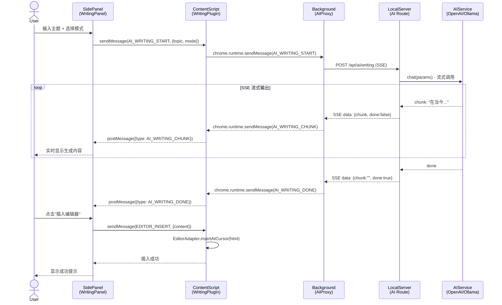
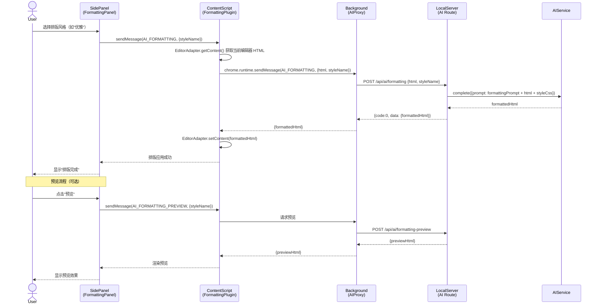
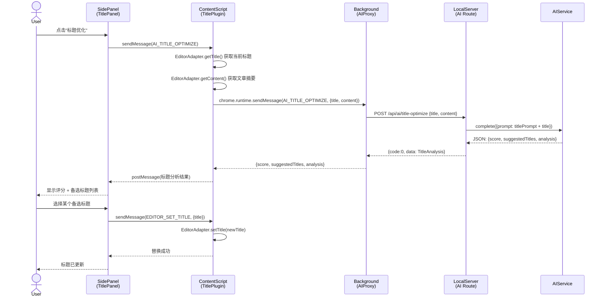
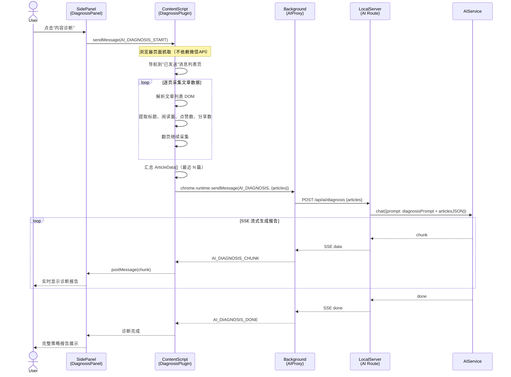
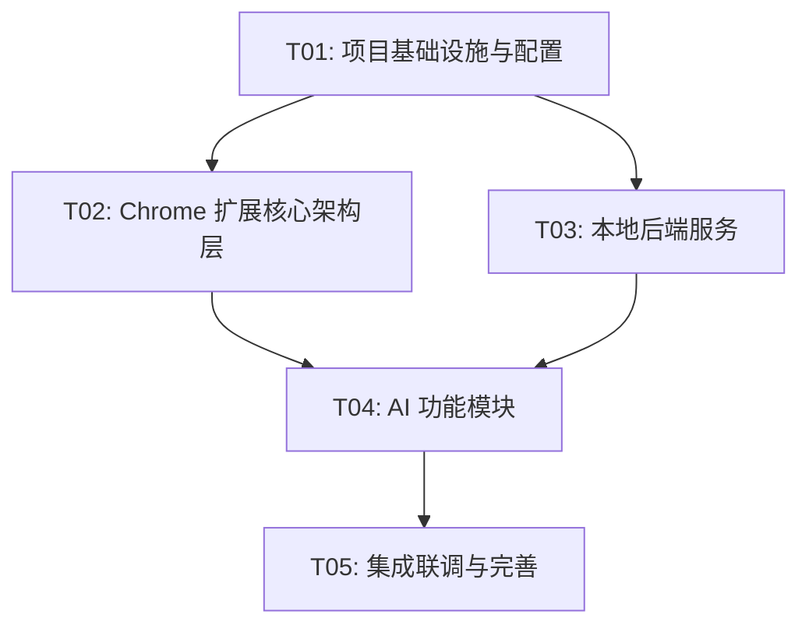

# 微信公众号AI助手 — 系统架构设计文档

> 版本：v0.1 | 日期：2025-07-25 | 作者：架构师 高见远

---

## 目录

1. [实现方案与框架选型](#1-实现方案与框架选型)
2. [文件列表及相对路径](#2-文件列表及相对路径)
3. [数据结构与接口（类图）](#3-数据结构与接口类图)
4. [程序调用流程（时序图）](#4-程序调用流程时序图)
5. [任务列表](#5-任务列表)
6. [依赖包列表](#6-依赖包列表)
7. [共享知识（跨文件约定）](#7-共享知识跨文件约定)
8. [待明确事项](#8-待明确事项)

---

## 1. 实现方案与框架选型

### 1.1 系统整体架构

系统采用**双层架构**：Chrome 扩展（前端）+ 本地后端服务（Node.js）。Chrome 扩展内部遵循**三层插件架构**（借鉴壹伴），功能模块以插件形式注册和加载。

```
┌─────────────────────────────────────────────────────────────────┐
│                     Chrome 扩展（Manifest V3）                    │
│                                                                   │
│  ┌──────────────┐   ┌──────────────┐   ┌──────────────────────┐ │
│  │   Popup      │   │  Background   │   │   Content Script     │ │
│  │   (React)    │◄──►│  Service      │◄──►│   (注入微信后台)      │ │
│  │              │   │  Worker       │   │                      │ │
│  └──────────────┘   │              │   │  ┌────────────────┐  │ │
│                     │ • 消息路由    │   │  │ 侧边面板       │  │ │
│                     │ • AI 代理     │   │  │  (React)       │  │ │
│                     │ • SSE 转发    │   │  ├────────────────┤  │ │
│                     │ • 状态管理    │   │  │ 功能插件        │  │ │
│                     │ • 存储管理    │   │  │ • AI写作       │  │ │
│                     └──────┬───────┘   │  │ • 标题优化     │  │ │
│                            │           │  │ • AI排版       │  │ │
│                            │ HTTP      │  │ • 内容诊断     │  │ │
│                            │ SSE       │  │ • 编辑器增强   │  │ │
│                            ▼           │  └────────────────┘  │ │
│                     ┌──────────────┐   │                      │ │
│                     │  本地后端服务  │   │  编辑器增强工具栏    │ │
│                     │  127.0.0.1:  │   │  (DOM 注入)         │ │
│                     │  3456        │   └──────────────────────┘ │
│                     └──────────────┘                             │
└─────────────────────────────────────────────────────────────────┘
                              │
                              │ API
                              ▼
                     ┌──────────────────┐
                     │  OpenAI / Ollama │
                     │  AI 模型服务      │
                     └──────────────────┘
```

### 1.2 Chrome 扩展架构设计（Manifest V3）

#### 三层插件架构

| 层 | 职责 | 技术 | 通信方式 |
|----|------|------|---------|
| **PluginBackground** | 消息路由、AI API 代理、SSE 流转发、状态/存储管理 | Service Worker (TS) | `chrome.runtime.sendMessage` / `chrome.runtime.onMessage` |
| **PluginContent** | DOM 注入、功能插件注册、微信编辑器操作、侧边面板渲染 | Content Script (TS + React 18) | `postMessage` / `chrome.runtime.sendMessage` |
| **PluginPage** | Popup 弹窗 UI、设置管理 | React 18 + MUI | `chrome.runtime.sendMessage` |

#### 关键设计决策

1. **Service Worker 生命周期**：MV3 的 Service Worker 会在空闲时休眠，需用 `chrome.storage.session` 保持运行时状态，`chrome.storage.local` 持久化配置。SSE 连接在 Service Worker 中建立，通过 `chrome.runtime.sendMessage` 将流式 chunk 转发给 Content Script。

2. **Content Script 注入策略**：使用 `manifest.json` 的 `content_scripts` 声明式注入 `mp.weixin.qq.com`，主入口 `content/index.ts` 负责初始化插件系统、注入侧边面板容器和编辑器增强工具栏。

3. **CSS 作用域隔离**：所有注入样式统一使用 `waa-` 前缀（WeChat AI Assistant），通过 Tailwind CSS `prefix` 配置自动添加。侧边面板使用 Shadow DOM 实现完全隔离。

4. **混合渲染模式**：简单 DOM 操作（工具栏按钮、格式插入）使用原生 DOM API；复杂交互组件（侧边面板、AI 写作面板）使用 React 18 渲染到 Shadow DOM 容器。

### 1.3 本地后端服务架构设计（Node.js）

```
┌─────────────────────────────────────────────┐
│            Local Server (Fastify)            │
│              127.0.0.1:3456                  │
│                                               │
│  ┌─────────┐ ┌──────────┐ ┌───────────────┐ │
│  │  Auth   │ │   AI     │ │    Data       │ │
│  │  Route  │ │  Route   │ │   Route       │ │
│  └────┬────┘ └────┬─────┘ └──────┬────────┘ │
│       │           │               │          │
│  ┌────┴────┐ ┌────┴─────┐ ┌──────┴────────┐ │
│  │  Auth   │ │ AIService│ │ DataService   │ │
│  │ Service │ │  (双模)   │ │               │ │
│  └────┬────┘ └──┬───┬───┘ └──────┬────────┘ │
│       │         │   │            │          │
│       │    ┌────┘   └────┐  ┌────┴─────┐    │
│       │    ▼             ▼  │          │    │
│       │  OpenAI      Ollama │ SQLite   │    │
│       │  Provider    Provider│ (better- │    │
│       │                     │ sqlite3) │    │
│       │                     └──────────┘    │
│  ┌────┴──────────────────────────────────┐  │
│  │           Middleware                   │  │
│  │  CORS │ Auth │ Error Handler │ Logger │  │
│  └───────────────────────────────────────┘  │
└─────────────────────────────────────────────┘
```

#### 核心设计

- **Web 框架**：Fastify（比 Express 更快，原生支持 TypeScript，内置 JSON Schema 校验）
- **AI 双模**：`AIService` 通过策略模式管理 `OpenAIProvider` 和 `OllamaProvider`，运行时根据用户配置切换
- **数据存储**：SQLite（better-sqlite3），零配置、单文件、适合本地服务场景
- **SSE 支持**：Fastify 原生支持流式响应，AI 生成内容以 SSE 格式推送

### 1.4 前端技术栈选型

| 技术 | 版本 | 选型理由 |
|------|------|---------|
| **Vite** | ^5.x | 极快的 HMR，原生 ESM，多入口构建支持（Content Script + Background + Popup + Side Panel） |
| **React** | ^18.2 | 组件化开发，Hooks 简化状态管理，成熟生态；壹伴也使用 React 17 渲染侧边面板 |
| **MUI** | ^5.14 | 企业级组件库，主题定制能力强，开箱即用的高级组件（Dialog、Drawer、Tabs 等） |
| **Tailwind CSS** | ^3.4 | 原子化 CSS，配合 `prefix: 'waa-'` 实现样式隔离，减少与微信后台样式冲突 |
| **TypeScript** | ^5.3 | 类型安全，接口定义清晰，减少运行时错误 |
| **Zustand** | ^4.5 | 轻量状态管理，无 Provider 包裹，适合 Chrome 扩展多上下文场景 |
| **crxjs/vite-plugin** | ^2.0 | Vite Chrome 扩展插件，自动处理 manifest、HMR、多入口打包 |

### 1.5 AI 模型接入方案

#### 双模架构

```typescript
// 策略模式：运行时切换 AI 提供者
interface AIProvider {
  chat(params: ChatParams): AsyncGenerator<string>;  // SSE 流式
  complete(params: CompleteParams): Promise<string>;  // 非流式
}

class OpenAIProvider implements AIProvider { ... }   // OpenAI API (GPT-4o-mini / GPT-4o)
class OllamaProvider implements AIProvider { ... }    // Ollama 本地模型 (Qwen2/Llama3)

class AIService {
  private provider: AIProvider;
  switchProvider(mode: 'openai' | 'ollama'): void;
}
```

#### Prompt 工程

每个 AI 功能对应一个系统 Prompt 模板，存储在 `local-server/src/prompts/` 目录：

| 功能 | Prompt 文件 | 说明 |
|------|-----------|------|
| AI 写作 | `writing.prompt.ts` | 长文/短文两种模式，输出 Markdown |
| 标题优化 | `title-optimize.prompt.ts` | 输出 JSON：评分 + 备选标题数组 |
| AI 排版 | `formatting.prompt.ts` | 输出排版后的 HTML |
| 内容诊断 | `diagnosis.prompt.ts` | 输出 Markdown 格式策略报告 |
| 违规检测 | `violation-check.prompt.ts` | 输出 JSON：风险列表 + 修改建议 |

---

## 2. 文件列表及相对路径

### 2.1 Chrome 扩展部分

```
chrome-extension/
├── public/
│   ├── manifest.json                          # MV3 清单文件
│   ├── icons/
│   │   ├── icon16.png
│   │   ├── icon48.png
│   │   └── icon128.png
│   └── popup.html                             # Popup 入口 HTML
│
├── src/
│   ├── background/                            # Background Service Worker
│   │   ├── index.ts                           # 入口：注册消息监听
│   │   ├── message-router.ts                  # 消息路由：分发到对应 handler
│   │   ├── ai-proxy.ts                        # AI 请求代理：转发到本地服务
│   │   ├── sse-relay.ts                       # SSE 流式转发：chunk → Content Script
│   │   ├── storage-manager.ts                 # 统一存储管理：chrome.storage 封装
│   │   └── port-manager.ts                    # 长连接管理：Content Script 端口保活
│   │
│   ├── content/                               # Content Script（注入微信后台）
│   │   ├── index.ts                           # 入口：初始化插件系统
│   │   ├── plugin-host.ts                     # 插件宿主：注册/管理功能插件
│   │   ├── injector.ts                        # DOM 注入器：侧边面板容器 + 工具栏
│   │   ├── editor-observer.ts                 # 编辑器监听：DOM 变更、选区变化
│   │   ├── editor-adapter.ts                  # 编辑器适配：读写微信编辑器内容
│   │   └── plugins/                           # 功能插件（继承 BasePlugin）
│   │       ├── base-plugin.ts                 # 插件基类
│   │       ├── writing-plugin.ts              # AI 写作插件
│   │       ├── title-plugin.ts                # 标题优化插件
│   │       ├── formatting-plugin.ts           # AI 排版插件
│   │       ├── diagnosis-plugin.ts            # 内容诊断插件
│   │       ├── editor-enhance-plugin.ts       # 编辑器增强插件
│   │       └── violation-plugin.ts            # 违规检测插件
│   │
│   ├── side-panel/                            # 侧边面板（React 应用）
│   │   ├── index.tsx                          # 入口：挂载到 Shadow DOM
│   │   ├── App.tsx                            # 根组件：路由 + 布局
│   │   ├── store/
│   │   │   ├── use-app-store.ts               # 全局状态（Zustand）
│   │   │   ├── use-writing-store.ts           # 写作面板状态
│   │   │   └── use-formatting-store.ts        # 排版面板状态
│   │   ├── components/
│   │   │   ├── SidePanel.tsx                  # 侧边面板布局
│   │   │   ├── TabNav.tsx                     # Tab 导航
│   │   │   ├── WritingPanel.tsx               # AI 写作面板
│   │   │   ├── TitlePanel.tsx                 # 标题优化面板
│   │   │   ├── FormattingPanel.tsx            # AI 排版面板
│   │   │   ├── DiagnosisPanel.tsx             # 内容诊断面板
│   │   │   ├── ViolationPanel.tsx             # 违规检测面板
│   │   │   ├── TemplatePanel.tsx              # 模板管理面板
│   │   │   ├── DashboardPanel.tsx             # 数据看板面板
│   │   │   └── SettingsPanel.tsx              # 设置面板
│   │   └── hooks/
│   │       ├── use-sse-stream.ts              # SSE 流式数据 Hook
│   │       ├── use-message.ts                 # Chrome 消息通信 Hook
│   │       └── use-editor-content.ts          # 编辑器内容读写 Hook
│   │
│   ├── popup/                                 # Popup 页面（React 应用）
│   │   ├── index.tsx                          # 入口
│   │   ├── App.tsx                            # 根组件
│   │   └── components/
│   │       ├── PopupMain.tsx                  # 主界面
│   │       └── SettingsForm.tsx               # 设置表单
│   │
│   ├── shared/                                # 共享代码（多上下文共用）
│   │   ├── types.ts                           # 全局类型定义
│   │   ├── constants.ts                       # 常量定义
│   │   ├── messages.ts                        # 消息类型定义（通信协议）
│   │   └── utils.ts                           # 通用工具函数
│   │
│   └── styles/                                # 样式文件
│       ├── side-panel.css                     # 侧边面板全局样式
│       ├── editor-toolbar.css                 # 编辑器增强工具栏样式
│       └── formatting-styles/                 # 排版预设风格
│           ├── elegant.css                    # 优雅风格
│           ├── tech.css                       # 科技风格
│           └── minimal.css                    # 极简风格
│
├── package.json
├── vite.config.ts
├── tailwind.config.ts
└── tsconfig.json
```

### 2.2 本地后端服务部分

```
local-server/
├── src/
│   ├── index.ts                               # 服务入口
│   ├── config.ts                              # 配置管理（端口、API Key 等）
│   │
│   ├── routes/                                # API 路由
│   │   ├── ai.ts                              # AI 相关路由（/api/ai/*）
│   │   ├── auth.ts                            # 认证路由（/api/auth/*）
│   │   ├── data.ts                            # 数据路由（/api/data/*）
│   │   └── template.ts                        # 模板路由（/api/template/*）
│   │
│   ├── services/                              # 业务服务
│   │   ├── ai-service.ts                      # AI 服务（策略模式调度）
│   │   ├── openai-provider.ts                 # OpenAI 提供者
│   │   ├── ollama-provider.ts                 # Ollama 提供者
│   │   ├── sensitive-words.ts                  # 敏感词检测服务
│   │   └── article-extractor.ts               # 文章正文提取服务
│   │
│   ├── prompts/                               # Prompt 模板
│   │   ├── writing.prompt.ts                  # AI 写作 Prompt
│   │   ├── title-optimize.prompt.ts           # 标题优化 Prompt
│   │   ├── formatting.prompt.ts               # AI 排版 Prompt
│   │   ├── diagnosis.prompt.ts                # 内容诊断 Prompt
│   │   └── violation-check.prompt.ts          # 违规检测 Prompt
│   │
│   ├── models/                                # 数据模型
│   │   ├── user.ts                            # 用户模型
│   │   ├── template.ts                        # 模板模型
│   │   ├── article.ts                         # 文章数据模型
│   │   └── diagnosis.ts                       # 诊断报告模型
│   │
│   ├── middleware/                             # 中间件
│   │   ├── auth.ts                            # JWT 认证中间件
│   │   ├── cors.ts                            # CORS 中间件
│   │   └── error-handler.ts                   # 错误处理中间件
│   │
│   └── database/                              # 数据库
│       ├── index.ts                           # 数据库初始化 + 连接
│       └── migrations/
│           └── 001_init.ts                    # 初始化迁移
│
├── data/                                      # 数据目录（SQLite 文件 + 敏感词库）
│   ├── waa.db                                 # SQLite 数据库文件
│   └── sensitive-words.txt                    # 基础敏感词库
│
├── package.json
└── tsconfig.json
```

---

## 3. 数据结构与接口（类图）

### 3.1 核心类图

```mermaid
classDiagram
    %% ===== Chrome 扩展 - Background 层 =====
    class BackgroundService {
        +initialize(): void
        +onMessage(listener: Function): void
        +sendMessage(msg: ExtMessage): void
    }

    class MessageRouter {
        -handlers: Map~string, MessageHandler~
        +register(type: string, handler: MessageHandler): void
        +route(message: ExtMessage): Promise~any~
    }

    class AIProxy {
        -baseUrl: string
        +request(endpoint: string, params: any): Promise~any~
        +requestSSE(endpoint: string, params: any): AsyncGenerator~string~
    }

    class SSERelay {
        -activePorts: Map~string, chrome.runtime.Port~
        +startRelay(stream: AsyncGenerator, port: Port): void
        +stopRelay(streamId: string): void
    }

    class StorageManager {
        +get(key: string): Promise~any~
        +set(key: string, value: any): Promise~void~
        +getSession(key: string): Promise~any~
        +setSession(key: string, value: any): Promise~void~
    }

    BackgroundService --> MessageRouter : uses
    MessageRouter --> AIProxy : routes to
    AIProxy --> SSERelay : streams via
    BackgroundService --> StorageManager : uses

    %% ===== Chrome 扩展 - Content Script 层 =====
    class PluginHost {
        -plugins: Map~string, BasePlugin~
        +register(plugin: BasePlugin): void
        +initialize(): void
        +getPlugin(name: string): BasePlugin
    }

    class BasePlugin {
        <<abstract>>
        #name: string
        #host: PluginHost
        +activate(): void
        +deactivate(): void
        +sendMessage(msg: ExtMessage): Promise~any~
        +onMessage(callback: Function): void
    }

    class WritingPlugin {
        -mode: WritingMode
        +startWriting(topic: string, mode: WritingMode): void
        +insertToEditor(content: string): void
    }

    class TitlePlugin {
        +analyzeTitle(title: string): Promise~TitleAnalysis~
        +replaceTitle(newTitle: string): void
    }

    class FormattingPlugin {
        -currentStyle: string
        +applyStyle(styleName: string): Promise~void~
        +previewStyle(styleName: string): Promise~string~
    }

    class DiagnosisPlugin {
        +collectArticleData(): Promise~ArticleData[]~
        +requestDiagnosis(data: ArticleData[]): Promise~DiagnosisReport~
    }

    class EditorEnhancePlugin {
        +insertFormat(type: FormatType): void
        +registerToolbar(): void
    }

    class ViolationPlugin {
        +scanContent(content: string): Promise~ViolationResult~
    }

    PluginHost --> BasePlugin : manages
    BasePlugin <|-- WritingPlugin
    BasePlugin <|-- TitlePlugin
    BasePlugin <|-- FormattingPlugin
    BasePlugin <|-- DiagnosisPlugin
    BasePlugin <|-- EditorEnhancePlugin
    BasePlugin <|-- ViolationPlugin

    class Injector {
        -sidePanelContainer: HTMLElement
        +injectSidePanel(): void
        +injectToolbar(): void
        +createShadowRoot(): ShadowRoot
    }

    class EditorAdapter {
        +getContent(): string
        +setContent(html: string): void
        +getTitle(): string
        +setTitle(title: string): void
        +insertAtCursor(html: string): void
        +getSelection(): SelectionInfo
    }

    class EditorObserver {
        -observer: MutationObserver
        +startWatch(): void
        +stopWatch(): void
        +onEditorReady(callback: Function): void
        +onContentChange(callback: Function): void
    }

    %% ===== Chrome 扩展 - 侧边面板 =====
    class SidePanelApp {
        -activeTab: string
        +render(container: ShadowRoot): void
        +switchTab(tab: string): void
    }

    %% ===== 本地后端服务 =====
    class LocalServer {
        -fastify: FastifyInstance
        +start(port: number): Promise~void~
        +stop(): Promise~void~
    }

    class AIService {
        -provider: AIProvider
        -currentMode: AIMode
        +switchProvider(mode: AIMode): void
        +chat(params: ChatParams): AsyncGenerator~string~
        +complete(params: ChatParams): Promise~string~
    }

    class AIProvider {
        <<interface>>
        +chat(params: ChatParams): AsyncGenerator~string~
        +complete(params: ChatParams): Promise~string~
    }

    class OpenAIProvider {
        -client: OpenAI
        -apiKey: string
        -baseUrl: string
        +chat(params: ChatParams): AsyncGenerator~string~
        +complete(params: ChatParams): Promise~string~
    }

    class OllamaProvider {
        -baseUrl: string
        -model: string
        +chat(params: ChatParams): AsyncGenerator~string~
        +complete(params: ChatParams): Promise~string~
    }

    AIService --> AIProvider : uses
    AIProvider <|.. OpenAIProvider
    AIProvider <|.. OllamaProvider
    LocalServer --> AIService : provides

    class SensitiveWordsService {
        -builtInWords: string[]
        -customWords: string[]
        +loadBuiltIn(): void
        +addCustomWords(words: string[]): void
        +scan(text: string): ViolationItem[]
    }

    class ArticleExtractor {
        +extract(url: string): Promise~ExtractedArticle~
        +toMarkdown(html: string): string
    }

    class DatabaseService {
        -db: Database
        +initialize(): void
        +run(sql: string, params: any[]): void
        +get(sql: string, params: any[]): any
        +all(sql: string, params: any[]): any[]
    }

    LocalServer --> DatabaseService : uses

    %% ===== 数据模型 =====
    class User {
        +id: string
        +email: string
        +name: string
        +avatar: string
        +aiMode: AIMode
        +openaiApiKey: string
        +ollamaBaseUrl: string
        +ollamaModel: string
        +createdAt: string
        +updatedAt: string
    }

    class Template {
        +id: string
        +userId: string
        +name: string
        +category: string
        +styleHtml: string
        +styleCss: string
        +preview: string
        +createdAt: string
    }

    class ArticleData {
        +title: string
        +url: string
        +publishTime: string
        +readCount: number
        +likeCount: number
        +shareCount: number
        +commentCount: number
    }

    class DiagnosisReport {
        +id: string
        +userId: string
        +articleCount: number
        +avgReadCount: number
        +topArticles: ArticleData[]
        +suggestions: DiagnosisSuggestion[]
        +generatedAt: string
    }

    class TitleAnalysis {
        +score: number
        +originalTitle: string
        +suggestedTitles: SuggestedTitle[]
        +analysis: string
    }

    class ViolationResult {
        +hasViolation: boolean
        +items: ViolationItem[]
        +riskLevel: RiskLevel
        +suggestions: string[]
    }

    User "1" --> "*" Template : owns
    User "1" --> "*" DiagnosisReport : has
    DiagnosisReport --> "*" ArticleData : analyzes
```



### 3.2 Chrome 扩展与本地后端 API 接口

#### API 概览

| 方法 | 路径 | 说明 | 请求体 | 响应 |
|------|------|------|--------|------|
| POST | `/api/ai/writing` | AI 写作（SSE） | `{topic, mode, style?, length?}` | SSE 流 `data: {chunk, done}` |
| POST | `/api/ai/title-optimize` | 标题优化 | `{title, content?}` | `{score, suggestedTitles, analysis}` |
| POST | `/api/ai/formatting` | AI 排版 | `{html, styleName}` | `{formattedHtml}` |
| POST | `/api/ai/diagnosis` | 内容诊断 | `{articles: ArticleData[]}` | SSE 流 或 `{report}` |
| POST | `/api/ai/violation-check` | 违规检测 | `{content}` | `{hasViolation, items, suggestions}` |
| POST | `/api/ai/formatting-preview` | 排版预览 | `{html, styleName}` | `{previewHtml}` |
| GET | `/api/auth/status` | 认证状态 | — | `{authenticated, user}` |
| POST | `/api/auth/login` | 登录 | `{email, password}` | `{token, user}` |
| GET | `/api/data/articles` | 获取文章数据 | — | `{articles: ArticleData[]}` |
| GET | `/api/data/dashboard` | 数据看板 | — | `{overview, trends, topArticles}` |
| GET | `/api/templates` | 模板列表 | — | `{templates: Template[]}` |
| POST | `/api/templates` | 创建模板 | `{name, category, styleHtml, styleCss}` | `{template}` |
| DELETE | `/api/templates/:id` | 删除模板 | — | `{success}` |
| GET | `/api/config/ai-modes` | 获取 AI 配置 | — | `{currentMode, openai, ollama}` |
| PUT | `/api/config/ai-mode` | 切换 AI 模式 | `{mode, openaiApiKey?, ollamaBaseUrl?}` | `{success}` |

#### 统一响应格式

```typescript
// 普通响应
interface ApiResponse<T> {
  code: number;       // 0 = 成功，非0 = 错误码
  data: T;            // 业务数据
  message: string;    // 提示信息
}

// SSE 流式响应（chunk）
interface SSEChunk {
  chunk: string;      // 本次输出的文本片段
  done: boolean;      // 是否完成
  error?: string;     // 错误信息（仅 done=true 且出错时）
}
```

### 3.3 Chrome 扩展内部通信协议

#### 消息类型定义

```typescript
// 扩展内部消息格式
interface ExtMessage {
  type: MessageType;        // 消息类型
  source: MessageSource;    // 发送方
  target: MessageTarget;    // 接收方
  payload: any;             // 消息数据
  requestId?: string;       // 请求 ID（用于响应匹配）
}

// 消息类型枚举
enum MessageType {
  // AI 相关
  AI_WRITING_START = 'AI_WRITING_START',
  AI_WRITING_CHUNK = 'AI_WRITING_CHUNK',       // Background → Content
  AI_WRITING_DONE = 'AI_WRITING_DONE',
  AI_TITLE_OPTIMIZE = 'AI_TITLE_OPTIMIZE',
  AI_FORMATTING = 'AI_FORMATTING',
  AI_DIAGNOSIS = 'AI_DIAGNOSIS',
  AI_VIOLATION_CHECK = 'AI_VIOLATION_CHECK',

  // 编辑器相关
  EDITOR_INSERT = 'EDITOR_INSERT',
  EDITOR_GET_CONTENT = 'EDITOR_GET_CONTENT',
  EDITOR_SET_CONTENT = 'EDITOR_SET_CONTENT',
  EDITOR_GET_TITLE = 'EDITOR_GET_TITLE',
  EDITOR_SET_TITLE = 'EDITOR_SET_TITLE',

  // 通用
  PING = 'PING',
  PONG = 'PONG',
  ERROR = 'ERROR',
}

// 消息来源
type MessageSource = 'popup' | 'side-panel' | 'content-script' | 'background';
```

---

## 4. 程序调用流程（时序图）

### 4.1 AI 写作完整流程



### 4.2 AI 排版完整流程



### 4.3 标题优化完整流程



### 4.4 内容诊断数据采集流程



---

## 5. 任务列表

> 按实现顺序排列，总计 5 个任务。每个任务按功能模块/层次分组。

### T01: 项目基础设施与配置

| 属性 | 值 |
|------|-----|
| **任务 ID** | T01 |
| **任务名称** | 项目基础设施与配置 |
| **复杂度** | M |
| **优先级** | P0 |
| **前置依赖** | 无 |

**描述**：搭建项目脚手架，包括 Chrome 扩展和本地后端服务的项目结构、配置文件、依赖声明、构建配置、TypeScript 配置、Manifest V3 清单文件。

**源文件**：
- `chrome-extension/package.json`
- `chrome-extension/tsconfig.json`
- `chrome-extension/vite.config.ts`
- `chrome-extension/tailwind.config.ts`
- `chrome-extension/public/manifest.json`
- `chrome-extension/public/popup.html`
- `chrome-extension/public/icons/` (icon16/48/128.png)
- `chrome-extension/src/shared/types.ts`
- `chrome-extension/src/shared/constants.ts`
- `chrome-extension/src/shared/messages.ts`
- `chrome-extension/src/shared/utils.ts`
- `local-server/package.json`
- `local-server/tsconfig.json`

**验收标准**：
- `npm run build` 能成功构建 Chrome 扩展和本地服务
- Chrome 扩展可加载到浏览器（即使功能为空）
- TypeScript 编译无错误
- Vite 多入口构建配置正确（Background / Content Script / Popup / Side Panel）

---

### T02: Chrome 扩展核心架构层

| 属性 | 值 |
|------|-----|
| **任务 ID** | T02 |
| **任务名称** | Chrome 扩展核心架构层 |
| **复杂度** | L |
| **优先级** | P0 |
| **前置依赖** | T01 |

**描述**：实现 Chrome 扩展的三层插件架构基础设施——Background Service Worker（消息路由、AI 代理、SSE 转发、存储管理）、Content Script 基类（插件宿主、DOM 注入器、编辑器适配/监听）、侧边面板 Shell（Shadow DOM 挂载、React 应用壳、Tab 导航）。

**源文件**：
- `chrome-extension/src/background/index.ts`
- `chrome-extension/src/background/message-router.ts`
- `chrome-extension/src/background/ai-proxy.ts`
- `chrome-extension/src/background/sse-relay.ts`
- `chrome-extension/src/background/storage-manager.ts`
- `chrome-extension/src/background/port-manager.ts`
- `chrome-extension/src/content/index.ts`
- `chrome-extension/src/content/plugin-host.ts`
- `chrome-extension/src/content/injector.ts`
- `chrome-extension/src/content/editor-observer.ts`
- `chrome-extension/src/content/editor-adapter.ts`
- `chrome-extension/src/content/plugins/base-plugin.ts`
- `chrome-extension/src/side-panel/index.tsx`
- `chrome-extension/src/side-panel/App.tsx`
- `chrome-extension/src/side-panel/store/use-app-store.ts`
- `chrome-extension/src/side-panel/components/SidePanel.tsx`
- `chrome-extension/src/side-panel/components/TabNav.tsx`
- `chrome-extension/src/side-panel/components/SettingsPanel.tsx`
- `chrome-extension/src/side-panel/hooks/use-message.ts`
- `chrome-extension/src/side-panel/hooks/use-sse-stream.ts`
- `chrome-extension/src/side-panel/hooks/use-editor-content.ts`
- `chrome-extension/src/styles/side-panel.css`
- `chrome-extension/src/popup/index.tsx`
- `chrome-extension/src/popup/App.tsx`
- `chrome-extension/src/popup/components/PopupMain.tsx`
- `chrome-extension/src/popup/components/SettingsForm.tsx`

**验收标准**：
- Background Service Worker 能接收和路由消息
- Content Script 能注入到 `mp.weixin.qq.com`
- 侧边面板能在微信后台页面内渲染（Shadow DOM 隔离）
- 编辑器适配器能读取/写入微信编辑器内容
- SSE 转发链路打通（Background → Content Script → Side Panel）
- `chrome.storage` 读写正常

---

### T03: 本地后端服务

| 属性 | 值 |
|------|-----|
| **任务 ID** | T03 |
| **任务名称** | 本地后端服务 |
| **复杂度** | L |
| **优先级** | P0 |
| **前置依赖** | T01 |

**描述**：实现 Node.js 本地后端服务——Fastify 服务搭建、AI 双模服务（OpenAI + Ollama）、Prompt 模板管理、数据存储（SQLite）、API 路由（AI/认证/数据/模板）、中间件（CORS/认证/错误处理）、数据库迁移、敏感词检测服务、文章采集服务。

**源文件**：
- `local-server/src/index.ts`
- `local-server/src/config.ts`
- `local-server/src/routes/ai.ts`
- `local-server/src/routes/auth.ts`
- `local-server/src/routes/data.ts`
- `local-server/src/routes/template.ts`
- `local-server/src/services/ai-service.ts`
- `local-server/src/services/openai-provider.ts`
- `local-server/src/services/ollama-provider.ts`
- `local-server/src/services/sensitive-words.ts`
- `local-server/src/services/article-extractor.ts`
- `local-server/src/prompts/writing.prompt.ts`
- `local-server/src/prompts/title-optimize.prompt.ts`
- `local-server/src/prompts/formatting.prompt.ts`
- `local-server/src/prompts/diagnosis.prompt.ts`
- `local-server/src/prompts/violation-check.prompt.ts`
- `local-server/src/models/user.ts`
- `local-server/src/models/template.ts`
- `local-server/src/models/article.ts`
- `local-server/src/models/diagnosis.ts`
- `local-server/src/middleware/auth.ts`
- `local-server/src/middleware/cors.ts`
- `local-server/src/middleware/error-handler.ts`
- `local-server/src/database/index.ts`
- `local-server/src/database/migrations/001_init.ts`
- `local-server/data/sensitive-words.txt`

**验收标准**：
- `npm start` 启动本地服务在 `127.0.0.1:3456`
- OpenAI 模式和 Ollama 模式可切换
- AI 写作接口返回 SSE 流
- 标题优化接口返回 JSON 评分结果
- 违规检测接口正常工作
- SQLite 数据库初始化成功
- 敏感词库加载正常
- CORS 允许 Chrome 扩展访问

---

### T04: AI 功能模块

| 属性 | 值 |
|------|-----|
| **任务 ID** | T04 |
| **任务名称** | AI 功能模块（写作/标题/排版/诊断/违规检测/编辑器增强） |
| **复杂度** | L |
| **优先级** | P0 |
| **前置依赖** | T02, T03 |

**描述**：实现所有 P0 + P1 AI 功能插件——AI 写作插件（SSE 流式）、标题优化插件（评分 + 备选）、AI 排版插件（3种预设风格）、内容诊断插件（数据采集 + 策略报告）、编辑器增强插件（格式工具栏）、违规检测插件。以及各功能对应的 Side Panel React 组件。

**源文件**：
- `chrome-extension/src/content/plugins/writing-plugin.ts`
- `chrome-extension/src/content/plugins/title-plugin.ts`
- `chrome-extension/src/content/plugins/formatting-plugin.ts`
- `chrome-extension/src/content/plugins/diagnosis-plugin.ts`
- `chrome-extension/src/content/plugins/editor-enhance-plugin.ts`
- `chrome-extension/src/content/plugins/violation-plugin.ts`
- `chrome-extension/src/side-panel/components/WritingPanel.tsx`
- `chrome-extension/src/side-panel/components/TitlePanel.tsx`
- `chrome-extension/src/side-panel/components/FormattingPanel.tsx`
- `chrome-extension/src/side-panel/components/DiagnosisPanel.tsx`
- `chrome-extension/src/side-panel/components/ViolationPanel.tsx`
- `chrome-extension/src/side-panel/components/TemplatePanel.tsx`
- `chrome-extension/src/side-panel/components/DashboardPanel.tsx`
- `chrome-extension/src/side-panel/store/use-writing-store.ts`
- `chrome-extension/src/side-panel/store/use-formatting-store.ts`
- `chrome-extension/src/styles/editor-toolbar.css`
- `chrome-extension/src/styles/formatting-styles/elegant.css`
- `chrome-extension/src/styles/formatting-styles/tech.css`
- `chrome-extension/src/styles/formatting-styles/minimal.css`

**验收标准**：
- AI 写作：输入主题 → SSE 流式输出 → 可插入编辑器
- 标题优化：评分 0-100 + 3-5 个备选标题 → 可一键替换
- AI 排版：3 种预设风格切换 → 格式统一无错乱
- 内容诊断：自动采集文章数据 → 生成策略报告
- 编辑器增强：工具栏按钮 → 点击即生效
- 违规检测：扫描全文 → 标记风险 + 修改建议
- 模板管理：保存/套用排版模板

---

### T05: 集成联调与完善

| 属性 | 值 |
|------|-----|
| **任务 ID** | T05 |
| **任务名称** | 集成联调与完善 |
| **复杂度** | M |
| **优先级** | P0 |
| **前置依赖** | T04 |

**描述**：端到端集成联调——Chrome 扩展与本地服务通信对接、功能插件注册与激活流程、编辑器 DOM 操作容错处理、CSS 隔离验证、错误处理与降级策略、Popup 设置页对接、端到端流程验证。

**源文件**：
- `chrome-extension/src/content/index.ts`（修改：注册所有插件）
- `chrome-extension/src/background/index.ts`（修改：注册所有路由）
- `chrome-extension/src/side-panel/App.tsx`（修改：接入所有面板）
- `chrome-extension/src/side-panel/components/SidePanel.tsx`（修改：Tab 路由完善）
- `chrome-extension/src/content/editor-adapter.ts`（修改：DOM 容错增强）
- `chrome-extension/src/content/editor-observer.ts`（修改：稳定性增强）
- `chrome-extension/src/background/ai-proxy.ts`（修改：错误重试）
- `chrome-extension/src/background/sse-relay.ts`（修改：断线重连）
- `chrome-extension/src/shared/constants.ts`（修改：补充常量）
- `chrome-extension/src/shared/utils.ts`（修改：补充工具函数）

**验收标准**：
- 所有 P0 功能端到端流程通畅
- 微信后台页面注入无样式冲突
- 编辑器操作稳定，DOM 变更容错
- SSE 流式输出无断流
- 错误场景有友好提示
- Popup 可修改 AI 配置

---

### 任务依赖图



---

## 6. 依赖包列表

### 6.1 Chrome 扩展 npm 依赖

```json
{
  "dependencies": {
    "react": "^18.2.0",
    "react-dom": "^18.2.0",
    "@mui/material": "^5.14.0",
    "@mui/icons-material": "^5.14.0",
    "@emotion/react": "^11.11.0",
    "@emotion/styled": "^11.11.0",
    "zustand": "^4.5.0"
  },
  "devDependencies": {
    "typescript": "^5.3.0",
    "vite": "^5.4.0",
    "@crxjs/vite-plugin": "^2.0.0-beta.25",
    "@vitejs/plugin-react": "^4.2.0",
    "tailwindcss": "^3.4.0",
    "postcss": "^8.4.0",
    "autoprefixer": "^10.4.0",
    "@types/react": "^18.2.0",
    "@types/react-dom": "^18.2.0",
    "@types/chrome": "^0.0.268"
  }
}
```

### 6.2 本地后端服务 npm 依赖

```json
{
  "dependencies": {
    "fastify": "^4.26.0",
    "@fastify/cors": "^9.0.0",
    "@fastify/static": "^7.0.0",
    "better-sqlite3": "^11.0.0",
    "openai": "^4.52.0",
    "jsonwebtoken": "^9.0.0",
    "bcryptjs": "^2.4.3",
    "dotenv": "^16.4.0",
    "pino": "^9.0.0",
    "@mozilla/readability": "^0.5.0",
    "jsdom": "^24.0.0",
    "turndown": "^7.2.0"
  },
  "devDependencies": {
    "typescript": "^5.3.0",
    "@types/better-sqlite3": "^7.6.0",
    "@types/jsonwebtoken": "^9.0.0",
    "@types/bcryptjs": "^2.4.0",
    "@types/jsdom": "^21.1.0",
    "@types/turndown": "^5.0.0",
    "tsx": "^4.16.0"
  }
}
```

### 关键依赖说明

| 依赖 | 用途 |
|------|------|
| `@crxjs/vite-plugin` | Vite Chrome 扩展开发插件，自动处理 manifest、HMR、多入口 |
| `zustand` | 轻量 React 状态管理，无需 Provider，适合扩展多上下文 |
| `better-sqlite3` | 同步 SQLite 驱动，性能优于异步驱动，适合本地服务 |
| `openai` | OpenAI 官方 SDK，支持流式输出 |
| `@mozilla/readability` + `jsdom` + `turndown` | 文章采集三件套：提取正文 → 解析 DOM → 转 Markdown |
| `pino` | 高性能 JSON 日志库 |

---

## 7. 共享知识（跨文件约定）

### 7.1 CSS 命名前缀约定

```
所有注入到微信后台的 CSS 必须使用 waa- 前缀（WeChat AI Assistant）

Tailwind CSS 配置：
  prefix: 'waa-'
  → 生成 waa-flex, waa-bg-blue-500, waa-p-4 等

自定义 CSS 类命名：
  .waa-side-panel          # 侧边面板容器
  .waa-toolbar             # 编辑器增强工具栏
  .waa-toolbar-btn         # 工具栏按钮
  .waa-writing-panel       # AI 写作面板
  .waa-title-score         # 标题评分显示
  .waa-formatting-preview  # 排版预览区域

Shadow DOM：侧边面板使用 Shadow DOM 完全隔离
  → Shadow DOM 内部样式不受外部影响，也不影响外部
  → 侧边面板内部可不加 waa- 前缀
```

### 7.2 通信协议格式

```typescript
// Chrome 扩展内部消息
interface ExtMessage {
  type: string;         // 消息类型（枚举值）
  source: string;       // 发送方标识
  target?: string;      // 接收方标识（可选，默认 Background）
  payload: any;         // 消息数据
  requestId?: string;   // 请求 ID（UUID），用于 request-response 模式
  timestamp: number;    // 时间戳
}

// 本地后端 API 响应
interface ApiResponse<T> {
  code: number;         // 0=成功, 1001=参数错误, 1002=认证失败, 2001=AI服务错误, 3001=存储错误
  data: T;
  message: string;
}

// SSE 流式 chunk
interface SSEChunk {
  chunk: string;        // 文本片段
  done: boolean;        // 是否结束
  error?: string;       // 错误信息
}
```

### 7.3 错误处理规范

```
错误码体系：
  0xxxx  → 扩展内部错误
    00001  未知错误
    00002  消息路由失败
    00003  Content Script 未就绪
    00004  编辑器 DOM 未找到

  1xxxx  → 本地服务错误
    10001  参数校验失败
    10002  认证失败 / Token 过期
    10003  资源未找到

  2xxxx  → AI 服务错误
    20001  AI 请求失败
    20002  API Key 无效
    20003  模型不可用
    20004  请求超时
    20005  内容安全过滤

  3xxxx  → 存储错误
    30001  数据库读写失败
    30002  chrome.storage 读写失败

错误展示：
  - SSE 流中断：侧边面板显示错误提示 + 重试按钮
  - API 请求失败：Toast 提示错误信息
  - 编辑器操作失败：静默失败 + 控制台日志

降级策略：
  - OpenAI 不可用 → 提示切换到 Ollama 模式
  - 本地服务不可达 → 显示连接引导（启动本地服务提示）
  - 编辑器 DOM 变更 → 自动重试 3 次，间隔 1s
```

### 7.4 日志规范

```
日志级别：
  error  → 影响功能的错误（必须修复）
  warn   → 非预期但可恢复的情况
  info   → 关键操作日志（API 调用、状态变更）
  debug  → 调试信息（仅开发环境）

Chrome 扩展日志：
  - Background: console.error/warn/info + chrome.storage 记录最近 100 条
  - Content Script: console.error/warn/info（可在 DevTools 查看）
  - Side Panel: console.error/warn/info（可在 DevTools 查看）

本地服务日志：
  - 使用 pino JSON 日志
  - 输出到 stdout + 日志文件 (logs/server.log)
  - 日志格式: {level, time, msg, requestId, duration?}
```

### 7.5 编辑器 DOM 选择器约定

```
微信编辑器关键选择器（需容错处理）：

编辑器正文: '#edui1_body_container' 或 '[contenteditable="true"]'
标题输入框: '#title' 或 '.weui-desktop-form__input' 首个
发布按钮: '.weui-desktop-btn_primary' 或包含"发布"文本的按钮

容错策略：
  1. 优先使用 ID 选择器
  2. 回退到属性选择器
  3. 回退到文本匹配
  4. 全部失败则提示"编辑器未就绪"

所有选择器集中定义在 shared/constants.ts 中，方便统一维护。
```

### 7.6 文件命名约定

```
文件命名：
  - TypeScript 文件：kebab-case（如 ai-proxy.ts, sse-relay.ts）
  - React 组件文件：PascalCase（如 WritingPanel.tsx, SidePanel.tsx）
  - 样式文件：kebab-case（如 side-panel.css, editor-toolbar.css）
  - Prompt 模板文件：kebab-case.prompt.ts（如 writing.prompt.ts）

目录命名：
  - 全部使用 kebab-case（如 side-panel/, editor-observer/）

插件命名约定（借鉴壹伴）：
  - 插件类名：XxxPlugin（如 WritingPlugin）
  - 插件注册名：kebab-case（如 writing-plugin）
  - 对应样式文件：writing-plugin.css
  - 自动注册：PluginHost 扫描插件目录，按命名约定加载
```

---

## 8. 待明确事项

| # | 事项 | 影响范围 | 建议/假设 |
|---|------|---------|----------|
| 1 | **微信编辑器 DOM 选择器** | 编辑器适配器 | 当前基于已知的 ID/属性选择器，微信可能随时变更 DOM 结构。建议实现选择器配置文件 + 自动探测降级机制。 |
| 2 | **微信 CSP 限制细节** | Content Script 注入 | 需实际测试微信公众平台 CSP 策略，确认是否允许 Shadow DOM、inline style 等。如有严格限制，侧边面板可能需要使用 iframe 隔离方案。 |
| 3 | **OpenAI API 可用性** | AI 功能 | 国内用户可能无法直接访问 OpenAI API，需通过本地服务代理。建议本地服务支持自定义 `baseUrl`（如中转 API）。 |
| 4 | **Ollama 模型推荐** | AI 功能 | 需确定推荐的 Ollama 模型（如 Qwen2-7B、Llama3-8B），以及最低硬件要求。 |
| 5 | **内容诊断数据采集范围** | 内容诊断 | "近 N 篇"的 N 值待定。建议默认 20 篇，用户可调整。采集过程需处理分页和懒加载。 |
| 6 | **账号系统实现深度** | 认证模块 | MVP 阶段账号系统是否需要完整的注册/登录/找回密码？还是简化为本地配置即可？建议 MVP 先做本地配置 + 简单密码保护，P1 再做完整账号体系。 |
| 7 | **云同步配置的范围** | 用户数据 | "云同步配置"具体指哪些数据？AI 模式偏好、模板、Prompt？需要明确同步范围。建议 MVP 先不做云同步，仅本地存储。 |
| 8 | **排版预设风格的具体规范** | AI 排版 | 3 种预设风格（优雅/科技/极简）的具体排版参数（字号、行距、配色、引用样式等）需进一步定义。 |
| 9 | **SSE 流式断线重连** | Background + Content Script | MV3 Service Worker 可能在 SSE 传输过程中休眠，需要确认是否使用 `chrome.alarms` 或 Port 保活机制。建议使用 `chrome.runtime.Port` 长连接保活。 |
| 10 | **@crxjs/vite-plugin 兼容性** | 构建系统 | `@crxjs/vite-plugin` beta 版与 Vite 5 的兼容性需验证，如不可用则降级为手动配置多入口。 |

---

## 附录：技术决策记录

| 决策 | 选项 | 选择 | 理由 |
|------|------|------|------|
| Web 框架（后端） | Express / Fastify / Koa | **Fastify** | 性能最优，原生 TS 支持，插件体系完善 |
| 状态管理 | Redux / Zustand / Jotai | **Zustand** | 轻量无 Provider，适合扩展多上下文 |
| CSS 隔离 | CSS Modules / Shadow DOM / BEM 前缀 | **Shadow DOM + Tailwind prefix** | Shadow DOM 完全隔离侧边面板；Tailwind prefix 隔离工具栏样式 |
| 数据库 | SQLite / LowDB / JSON 文件 | **SQLite (better-sqlite3)** | 结构化查询、事务支持、成熟稳定 |
| 构建工具 | Webpack / Vite / Rollup | **Vite + @crxjs** | 开发体验最佳，HMR 支持 |
| AI SDK | openai 官方 / 自封装 | **openai 官方 SDK** | 流式输出支持好，类型完善，维护活跃 |
| DOM 操作 | jQuery / 原生 DOM | **原生 DOM API** | 减少依赖体积，MV3 对 jQuery 支持不佳 |
